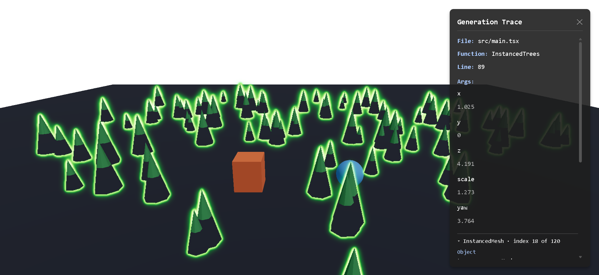
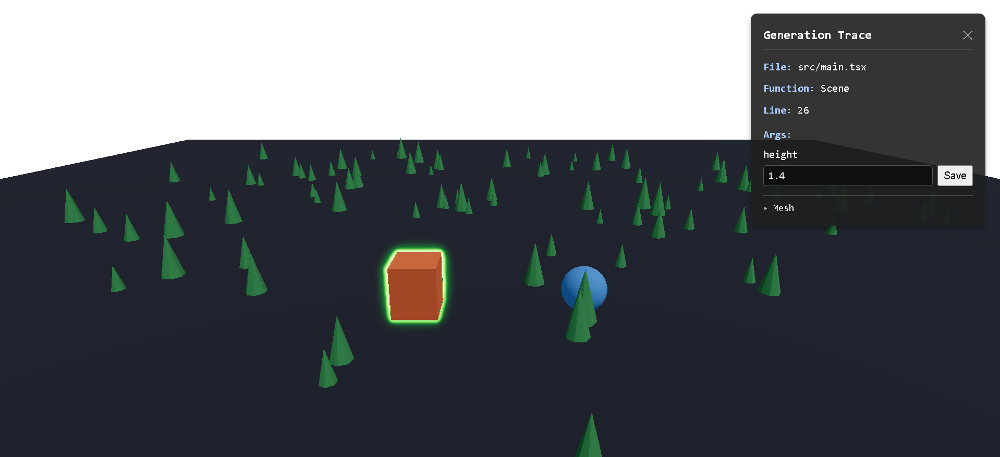

# Click-to-Source 3D

**Source-level debugging for React Three Fiber.**

---

## Introduction

Developers working on Three.js and React Three Fiber scenes often spend significant time locating the exact application code responsible for rendered output. Complex scenes with hundreds of generated objects make this a tedious, manual process — there is no built-in way to click a rendered mesh and jump straight to the source that created it.

**Click-to-Source 3D** aims to bridge runtime rendering and source code by allowing developers to interact directly with rendered objects and trace them back to the source responsible for generating them. Think of it as the 3D equivalent of browser DevTools' "Inspect Element" — but for Three.js scenes.

Unlike DOM-focused click-to-source tools or general Three.js scene inspectors, this tool traces rendered objects back to the exact generator function and arguments that created them, not just their current runtime state.


*No metadata was written for this object. The build-time transform stamps every
host element with its own source location, so clicking an untagged mesh still
names the file, function and line that produced it.*



*One `InstancedMesh`, 120 trees. The panel resolves the individual instance you
clicked and shows the transform that placed it. Instanced values are read-only,
and the outline is mesh-wide, so every instance lights up. In the expanded
details, `object.type` reads `Mesh`: three.js gives `InstancedMesh` no `type`
string of its own, so the summary line above is what tells the two apart.*



*Where you have written `args` by hand, values become editable. Save rewrites
the literal in your source and Vite hot-reloads.*

## Goals

- **Runtime Provenance** — Track which source code and parameters produced each rendered object.
- **Interactive Source Tracing** — Click any object in a 3D scene and jump to its origin in your editor.
- **Fast Debugging Workflow** — Eliminate guesswork when debugging procedural or generated geometry.
- **Better AI Context** — Provide structured provenance data that AI tools can consume for smarter assistance.
- **Developer Tooling** — Integrate seamlessly into existing Three.js and React Three Fiber workflows.

## Current Status

**Stage 7 — release.** Five packages at `0.1.2`, versioned in lockstep and
verified by installing all five into a consumer outside this repository.

`0.1.x` is deliberate rather than modest: instanced provenance is read-only,
scene addresses cannot detect a world regeneration, and the public API surface
was curated for the first time immediately before release.

Earlier stages are recorded in `docs/architecture/`, and the tags
`stage5-complete` and `stage6-complete` mark verified checkpoints, each paired
with the commit of the dogfooding consumer it was verified against.

## Packages

| package | what it is |
|---|---|
| `@click-to-source-3d/shared` | The `SourceRef` contract and protocol constants. Types, no runtime. |
| `@click-to-source-3d/core` | Provenance resolution and per-instance capture. Browser-pure. |
| `@click-to-source-3d/overlay` | React Three Fiber components: selection, the trace panel, the bridge. |
| `@click-to-source-3d/vite-plugin` | Dev-server endpoints, JSX source stamping, the scene bridge. |
| `@click-to-source-3d/mcp` | An MCP server exposing the same provenance to coding agents. |

## Scope — React Three Fiber only

Source stamping is a JSX transform, the overlay is React, the bridge component
needs the R3F tree, and the dev-server half needs Vite. Plain Three.js can use
`@click-to-source-3d/core` with hand-written `userData.sourceRef`, but the
experience this project is about is R3F.

## What it costs to adopt

Two installs bring four packages, and four things go into your app: the plugin,
a pointer handler — the only one of the four that is not a component — one
component inside the `Canvas` and one outside it. The `Canvas` also takes an
`onPointerMissed` prop, which is what clears the selection on an empty click.
`<ClickToSourceBridge />` is a fifth, needed only for the agent tools in
`@click-to-source-3d/mcp`; the example below includes it. Every feature is
opt-in and dev-only. The next section is the working code.

## Getting Started

### 1. Install

```bash
npm install @click-to-source-3d/overlay
npm install -D @click-to-source-3d/vite-plugin
```

`core` and `shared` arrive as dependencies. Add `@click-to-source-3d/mcp` if
you want the agent tools.

### 2. `vite.config.js`

```js
import { defineConfig } from 'vite';
import react from '@vitejs/plugin-react';
import { clickToSource } from '@click-to-source-3d/vite-plugin';

export default defineConfig({
  plugins: [
    clickToSource({
      stampSource: true,      // stamp file/function/line into userData
      captureInstances: true, // per-instance transforms for InstancedMesh
      bridge: true,           // let an agent query the running scene
    }),
    react(),
  ],
});
```

Listing `clickToSource()` first is habit worth keeping, but with
`@vitejs/plugin-react` either order stamps identically: that plugin performs no
JSX transform of its own, so there is nothing for it to consume before this one
runs. If stamping ever produces nothing, the plugin says so and names the fix.

### 3. The JSX

Two components go inside the `Canvas`, one goes outside it, and a `<group>`
carries the pointer handler.

```jsx
import { Canvas } from '@react-three/fiber';
import {
  useClickToSource,
  useOverlayStore,
  SelectionHighlight,
  GenerationTrace,
  ClickToSourceBridge,
} from '@click-to-source-3d/overlay';

function Scene() {
  const resolveClick = useClickToSource();

  const handlePointerUp = (e) => {
    e.stopPropagation();
    const resolved = resolveClick(e);
    if (resolved) {
      useOverlayStore.getState().select(resolved);
    } else {
      useOverlayStore.getState().clearSelection();
    }
  };

  return (
    <>
      <SelectionHighlight />
      <group onPointerUp={handlePointerUp}>
        {/* your scene */}
      </group>
    </>
  );
}

export default function App() {
  const handlePointerMissed = () => {
    useOverlayStore.getState().clearSelection();
  };

  return (
    <>
      <Canvas onPointerMissed={handlePointerMissed}>
        <ClickToSourceBridge />
        <Scene />
      </Canvas>

      {/* Outside the Canvas: GenerationTrace renders DOM, not scene objects */}
      <GenerationTrace />
    </>
  );
}
```

`onPointerMissed` on the `Canvas` is what clears the selection when you click
empty space.

### 4. `InstancedMesh` needs its bounding volumes recomputed

Raycasts test an instanced mesh's bounding volume before its instances. A mesh
constructed before its matrices are written has a bounding volume that does not
cover them, so clicks miss and the mesh appears to have no provenance at all.

After the placement loop, mark the matrices dirty and recompute:

```jsx
function InstancedTreeMesh({ geometry, material, matrices }) {
  const meshRef = useRef();

  useEffect(() => {
    if (!meshRef.current || !matrices?.length) return;
    matrices.forEach((m, i) => meshRef.current.setMatrixAt(i, m));
    meshRef.current.instanceMatrix.needsUpdate = true;
    meshRef.current.computeBoundingBox();
    meshRef.current.computeBoundingSphere();
  }, [matrices]);

  if (!matrices?.length) return null;

  return (
    <instancedMesh
      ref={meshRef}
      args={[geometry, material, matrices.length]}
      frustumCulled={false}
    />
  );
}
```

This is also the write the capture probe observes, so the same `setMatrixAt`
loop that places your instances is what gives them per-instance provenance.

### 5. If you use `frameloop="demand"`

`<SelectionHighlight />` draws through the render loop at `useFrame` priority 1,
which makes R3F hand rendering over to it. Under `frameloop="demand"` it
requests a frame whenever the selection changes, so it works.

Under `frameloop="never"` it cannot — your application drives frames, so call
`advance()` after changing the selection. It warns once in development rather
than failing silently.

It also will not compose with other post-processing that claims a `useFrame`
priority: whichever renders last wins and the other's output is discarded.

## Limits worth knowing before you adopt it

**Instanced provenance is read-only.** An instance's transform comes from
whatever placed it, usually a seeded RNG, so there is no literal in your source
to rewrite. The panel shows the values and refuses to edit them.

**Variant-class values cannot be recovered.** Automatic capture reads a
`Matrix4`, so it recovers `x`, `y`, `z`, `scale` and `yaw` — and nothing else.
Which colour group, species or material variant an instance belongs to is not
in the transform. Capture recovers *placement*, not *classification*. Those
values used to exist, in the hand-maintained `instanceSourceRefs` arrays that
automatic capture replaced; that is a real trade, not an oversight. Keep
writing them by hand if you need the classification.

**Selection highlighting is mesh-wide for instanced meshes.** Clicking one
instance outlines every instance in that `InstancedMesh`. Resolution is
per-instance and correct; only the outline is coarse.

**Scene addresses do not detect regeneration.** They are derived from source
location, so they survive a remount — but if your world rebuilds with different
placements, the same address resolves to a different object and nothing reports
that it changed.

## Roadmap

| Stage | Milestone | Status |
|-------|-----------|--------|
| 0 | Scope freeze | done |
| 1 | Prove the mechanism | done |
| 2 | Provenance convention | done |
| 3 | Core engine + overlay | done |
| 4 | Dogfooding | done |
| 5 | Package polish | done — `stage5-complete` |
| 6 | MCP / agent mode | done — `stage6-complete` |
| 6.5 | Auto-instrumentation | done — shipped as `stampSource`, no longer optional or research |
| 7 | Ship | done — first release was `0.1.0`, not 1.0 |

The 1.0 in the original plan was optimistic. This released at `0.1.0`: the API
surface has only just been curated deliberately, instanced provenance is
read-only, and there is no staleness detection for scene addresses. `0.x` says
that honestly.

For the original plan, see [`docs/roadmap/`](docs/roadmap/).

## `<ClickToSourceBridge />` and background tabs

The bridge answers queries about the running scene, and must be inside the
`Canvas`, since only a component in the R3F tree can supply a scene and a
camera.

It answers only while the page is actually rendering. R3F does not render
`Canvas` children in a hidden or background tab, so the component never mounts
and every bridge query reports `disconnected` — indistinguishable from no page
being open. This matters when driving the app headlessly: keep the page
visible, or expect `disconnected`.

## Repository Structure

```
click-to-source/
│
├── docs/                        # Project documentation
│   ├── architecture/            # Architecture decisions and design docs
│   ├── research/                # Research and competitor analysis
│   ├── tech-stack/              # Technology stack documentation
│   ├── roadmap/                 # Project roadmap and milestones
│   └── assets/                  # Documentation assets (diagrams, images)
│
├── packages/                    # Monorepo packages (npm workspaces)
│   ├── shared/                  # SourceRef contract and protocol constants
│   ├── core/                    # Provenance resolution, instance capture
│   ├── overlay/                 # React Three Fiber inspection components
│   ├── vite-plugin/             # Dev-server endpoints, stamping, bridge
│   ├── mcp/                     # MCP server for coding agents
│   └── examples/                # Example projects and demos
│
├── scripts/                     # Build, release, and development scripts
│
├── .github/                     # GitHub configuration
│   ├── ISSUE_TEMPLATE/          # Issue templates
│   ├── workflows/               # CI/CD workflows
│   └── pull_request_template.md # PR template
│
└── .vscode/                     # Editor configuration
```

## Documentation

Detailed project documentation is available in the [`docs/`](docs/) directory:

- **[Architecture](docs/architecture/)** — System design and architectural decisions.
  - [`metadata-convention.pdf`](docs/architecture/metadata-convention.pdf) — Permanent architectural contract and canonical SourceRef tagging convention.
  - [`future-auto-instrumentation-design.md`](docs/architecture/future-auto-instrumentation-design.md) — Future design document for automatic instrumentation.
  - [`Stage2_Architectural_Validation_Report.pdf`](docs/architecture/Stage2_Architectural_Validation_Report.pdf) — Stage 2 architectural validation report.
- **[Research](docs/research/)** — Technical approaches, competitor analysis, and experimental validation.
  - [`Click-to-Source_Technical_Approaches.pdf`](docs/research/Click-to-Source_Technical_Approaches.pdf) — Technical approach analysis.
  - [`Stage1_Experimental_Report.pdf`](docs/research/Stage1_Experimental_Report.pdf) — Stage 1 experimental validation report.
- **[Tech Stack](docs/tech-stack/)** — Technology choices and rationale.
- **[Roadmap](docs/roadmap/)** — Detailed project roadmap and milestones.

## Contributing

Contributions are welcome! Please read our [Contributing Guidelines](CONTRIBUTING.md) and our [Code of Conduct](CODE_OF_CONDUCT.md).
If you are opening an issue, please use the provided [Issue Templates](.github/ISSUE_TEMPLATE/).

## License

This project is licensed under the [MIT License](LICENSE).

---

<sub>Click-to-Source 3D is an open-source developer tool. Built for the Three.js and React Three Fiber community.</sub>
