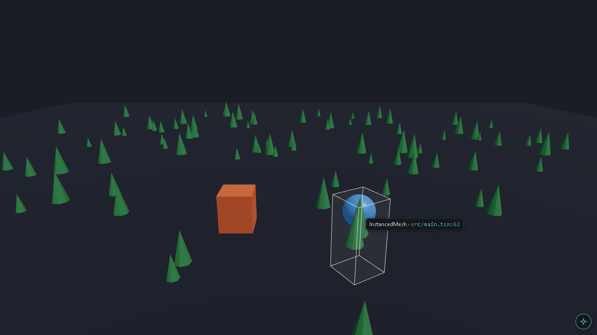
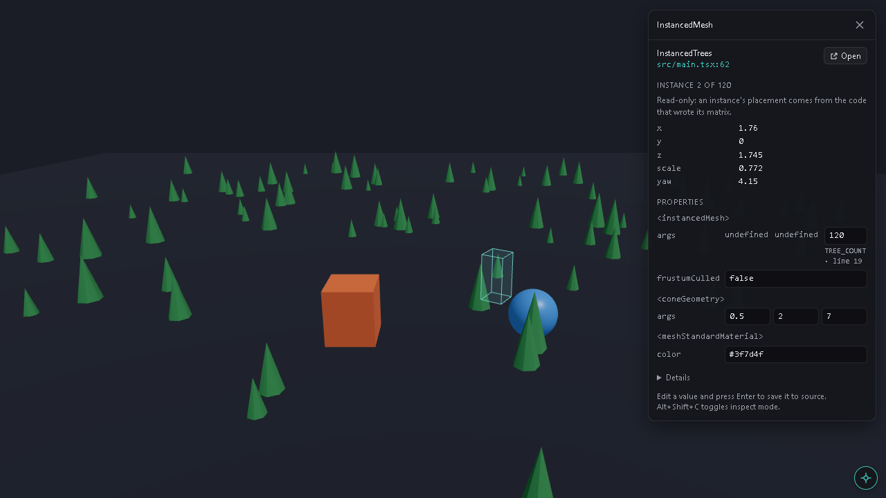

# Click-to-Source 3D

[](https://github.com/pun1th01/click-to-source-3d/actions/workflows/ci.yml)

**Inspect any object in a React Three Fiber scene: see the line of code that
created it, and change its values in place.**

Think of it as DevTools' "Inspect Element" for 3D. Press **Alt+Shift+C**, click
a mesh, and a panel names the file, component and line it came from, with its
props as editable fields. Press Enter, and the value is rewritten in your
source and Vite hot-reloads it.


## Quick start

**You need** a React Three Fiber app served by Vite:

| | version |
|---|---|
| Node.js | 20.19 or later |
| Vite | 6, 7 or 8 |
| React Three Fiber | 9 |
| three.js | 0.170 or later |

**1. Set it up.** In your app's folder, the one with `package.json` and
`vite.config`, run:

```bash
npx click-to-source-3d init
```

`npx` works whichever package manager your project uses. If you prefer, run
`pnpm dlx click-to-source-3d init` or `bunx click-to-source-3d init` instead.

`init` does three things, and prints each as it goes:

- It installs `@click-to-source-3d/vite-plugin` as a dev dependency, using the
  package manager your lockfile names (npm, pnpm, yarn or bun).
- It adds `clickToSource()` to the `plugins` in your `vite.config`. Nothing
  else in the file changes.
- It asks whether to set up the tools for AI coding assistants. The answer
  defaults to no; see [below](#for-ai-coding-assistants).

Running it twice changes nothing. If it can't edit your config safely, it
prints the two lines to add yourself; see
[Setting it up by hand](#setting-it-up-by-hand).

**2. Start your app** as usual:

```bash
npm run dev
```

**3. Inspect.** Open the app in your browser and press **Alt+Shift+C**, or
click the round button in the bottom-right corner of the canvas. Then click
any object.

That is the whole setup. There is nothing to import, no component to mount
and no tag to write.

## What you get

**Inspect mode.** Alt+Shift+C, or the button on the canvas, turns it on. Hover
to see what is under the pointer and where it came from; click to open the
panel. Clicks go to the inspector, not your app, but dragging still orbits the
camera. Esc leaves inspect mode, and Esc again closes the panel.



**Where it came from.** The component and line that created the object, and an
**Open** button that jumps to it in your editor.

**Its values, editable.** Every literal prop on the element is listed, along
with those on the geometry and material inside it: `position={[0, 1, 2]}`,
`args={[1.2, 2, 1.2]}`, `color="#c2643c"`. A prop that names a constant
declared in the same file — `args={[1.2, BOX_HEIGHT, 1.2]}` — is followed to
the declaration and edited there. A computed value such as
`noise(x, z) * 8` is shown as code but not editable. Edit a value and press
Enter: the literal is rewritten in place, your formatting is untouched, and if
the file has changed since, the edit is refused rather than landing on the
wrong value.

**One instance at a time.** Click one tree in an `InstancedMesh` of 120 and you
get that tree: its position, scale and rotation, and a highlight around it
alone.



**Nothing in production.** The plugin does nothing in a build. The inspector is
added only to pages the dev server serves, so none of it reaches your users.

## How it works

- **At build time,** the Vite plugin gives every three.js element in your JSX
  a small record of where it is: file, component, line and column, and each of
  its literal props with its exact position. Your source files are not
  changed; only the code Vite serves in development.
- **In the page,** the plugin adds the inspector before your app loads. It
  finds your renderers through three.js's own devtools hook, draws its
  highlight after your frame rather than taking over the render loop (so
  post-processing keeps working), and lives in a shadow root your CSS cannot
  touch.
- **On the dev server,** a few endpoints read files, rewrite a single literal,
  and open your editor. They answer only to the page itself and to programs on
  your machine, and only for source files inside the project.

## For AI coding assistants

Click-to-Source also gives AI coding assistants — Claude Code, Cursor, VS Code
with Copilot, Windsurf and others that speak MCP — the same view of your scene.
An assistant can list what is in the running scene, ask what is under a point
on screen, read the code that made it, and change a value, which hot-reloads
like any other edit.

Answer yes when `init` asks, or skip the question:

```bash
npx click-to-source-3d init --mcp
```

That installs `@click-to-source-3d/mcp` and registers it in `.mcp.json` at
the root of your repository. That file is Claude Code's, and Claude Code asks
you to approve the server the first time it starts in the project.

Other assistants keep their own config file. Add the same entry to it:

| assistant | file | key |
|---|---|---|
| Claude Code | `.mcp.json` (written by `init`) | `mcpServers` |
| Cursor | `.cursor/mcp.json` | `mcpServers` |
| VS Code | `.vscode/mcp.json` | `servers` |

```json
{
  "mcpServers": {
    "click-to-source": { "command": "npx", "args": ["-y", "@click-to-source-3d/mcp"] }
  }
}
```

On Windows, start it through `cmd`:
`"command": "cmd", "args": ["/c", "npx", "-y", "@click-to-source-3d/mcp"]`.

There is nothing else to configure. The server finds your running dev server
by itself, even when the dev server starts after the assistant does or on an
unusual port. The tools that ask about the scene also need the app open in a
visible browser tab. The [MCP package](packages/mcp/) lists the tools it
offers.

## Setting it up by hand

This is everything `init` does. First, install the plugin as a dev
dependency:

```bash
npm install -D @click-to-source-3d/vite-plugin
```

With another package manager, use `pnpm add -D`, `yarn add -D` or `bun add -d`
instead.

Then add it to `plugins` in your Vite config. It can go before or after
`react()`:

```js
// vite.config.js (or .ts)
import { defineConfig } from 'vite';
import react from '@vitejs/plugin-react';
import { clickToSource } from '@click-to-source-3d/vite-plugin';

export default defineConfig({
  plugins: [clickToSource(), react()],
});
```

`clickToSource()` takes options to change the shortcut, hide the button, or
turn parts off. The [plugin's README](packages/vite-plugin/) lists them.

## Upgrading from 0.1.4 or earlier

1. **Update the plugin**, and the MCP server if you installed it:

   ```bash
   npm install -D @click-to-source-3d/vite-plugin@latest
   ```

   ```bash
   npm install -D @click-to-source-3d/mcp@latest
   ```

2. **Simplify the config.** `clickToSource({ stampSource: true, bridge: true })`
   becomes `clickToSource()`, since both are now on by default.
   `captureInstances` no longer does anything and can go.

3. **Remove the wiring.** You can delete the components you mounted by hand
   (`<SelectionHighlight />`, `<GenerationTrace />` and
   `<ClickToSourceBridge />`), the click handler and the `onPointerMissed`
   that went with them, and then the overlay package itself:

   ```bash
   npm uninstall @click-to-source-3d/overlay
   ```

   They still work if you keep them, and the inspector stands aside for them
   and says so once in the console.

4. **Drop the MCP environment variables.** `CTS_DEV_SERVER` and
   `CTS_PROJECT_ROOT` are no longer needed, although they still override what
   the server finds.

Hand-written `userData.sourceRef` metadata is no longer needed for editable
values. It still works, and still wins where you have it.

## Troubleshooting

**No button, and Alt+Shift+C does nothing.**
- The inspector exists only on the dev server (`vite` or `npm run dev`), not
  in `vite build` or `vite preview` output.
- Check that `clickToSource()` is in `plugins`.
- The button appears once a canvas has rendered.
- In the browser console, `__CTS_DEVTOOLS__` should print an object. If it is
  `undefined`, the plugin isn't running on this page; restart the dev server.

**Alt+Shift+C is already taken.** Choose another shortcut:
`clickToSource({ inspector: { hotkey: 'ctrl+shift+x' } })`.

**Open starts the wrong editor.** Set the `LAUNCH_EDITOR` environment
variable before starting the dev server, for example to `code`, `cursor` or
`webstorm`.

**An object shows "No source found".** It was created by a library component,
such as drei's `<Box>`, or by code that isn't JSX. The panel names its parents
so you can find the nearest element of yours.

## Removing it

Delete `clickToSource()` and its import from your Vite config, then
uninstall the plugin:

```bash
npm uninstall @click-to-source-3d/vite-plugin
```

If you set up the assistant tools, also uninstall `@click-to-source-3d/mcp`
and remove the `click-to-source` entry from `.mcp.json`.

## Scope

**React Three Fiber, served by Vite.** Plain three.js, with nothing tagged by
hand, is the next milestone (`0.2.0`); webpack and Next.js are on the roadmap.

## Limits worth knowing

**What counts as an element is a lowercase JSX tag.** `<mesh>`, `<group>`,
`<instancedMesh>`, and wrappers such as `<animated.mesh>` are tracked. A
component from a library — drei's `<Box>`, say — renders its own elements
inside that library, so an object it makes resolves to the nearest element of
yours around it, or to "no source found".

**Editable means a literal.** A value computed at runtime, a prop passed in
from a parent, or a constant imported from another file is shown but not
editable. A constant declared in the same file is followed only when nothing
else in the file has the same name.

**An instance's placement is read-only.** It comes from whatever wrote its
matrix, usually a loop with a random seed, so there is no single number in
your source to change. The geometry, material and count are editable as usual.

**An instance's transform is all that is known about it.** Which colour
group, species or variant it belongs to is not in a transform. Write
`userData.instanceSourceRefs` by hand if you need that.

**Scene addresses do not detect a regenerated world.** They survive a remount,
but if your world is rebuilt with different placements, the same address
names a different object, and nothing says so.

**The page has to be visible for an assistant to ask about it.** Browsers stop
rendering a background tab, and the scene answers only while it renders.

## Packages

Install one: the plugin, which `init` does for you.

| package | what it is |
|---|---|
| `@click-to-source-3d/vite-plugin` | **The one you install.** Stamping, the injected inspector, the dev-server endpoints, the bridge for assistants. |
| `click-to-source-3d` | The `init` command. Run with `npx`; never added to your project. |
| `@click-to-source-3d/mcp` | Optional. The MCP server for AI coding assistants. |
| `@click-to-source-3d/core` | Internal: resolving an object to its source, picking, the highlight. Bundled into the plugin. |
| `@click-to-source-3d/shared` | Internal: the types both halves agree on. |
| `@click-to-source-3d/overlay` | **Legacy.** The React components from before the inspector was built in. Kept working for now; removed in a later release. |

## Roadmap

| Stage | Milestone | Status |
|-------|-----------|--------|
| 0–6.5 | Proof, convention, engine, dogfooding, packaging, MCP, stamping | done |
| 7 | Ship | done — first release `0.1.0` |
| 8 | One command, no wiring, for R3F | done — `0.1.5` |
| 9 | Plain three.js, nothing tagged | next — `0.2.0` |

**Stage 9** brings the inspector to plain three.js. Click a mesh and see the
line that created it, the chain of calls that led there with the values they
were called with, and the helpers they used, such as a noise function. A
prototype of the transform behind it already works on untagged code. `0.2.0`
will be the first version to support both three.js and React Three Fiber.

The full plan is in
[`docs/roadmap/`](docs/roadmap/Click-to-Source_Implementation_Plan_0.1.5-0.2.0.pdf),
and what changed in each release is in [`CHANGELOG.md`](CHANGELOG.md).

## Repository Structure

```
click-to-source/
├── packages/
│   ├── vite-plugin/   # the plugin: stamping, injected inspector, endpoints
│   ├── cli/           # npx click-to-source-3d init
│   ├── mcp/           # MCP server for AI coding assistants
│   ├── core/          # resolution, picking, highlight (bundled into the plugin)
│   ├── shared/        # types shared by both halves
│   ├── overlay/       # legacy React components
│   └── examples/      # a plain R3F scene with only the plugin added
├── e2e/               # browser tests against the example
└── docs/              # architecture notes, research, roadmap
```

## Contributing

Contributions are welcome! Please read the [Contributing Guidelines](CONTRIBUTING.md).
Participants are expected to follow the [Contributor Covenant](https://www.contributor-covenant.org/version/2/1/code_of_conduct/).
If you are opening an issue, please use the provided [Issue Templates](.github/ISSUE_TEMPLATE/).

## License

This project is licensed under the [MIT License](LICENSE).

---

<sub>Click-to-Source 3D is an open-source developer tool. Built for the Three.js and React Three Fiber community.</sub>
